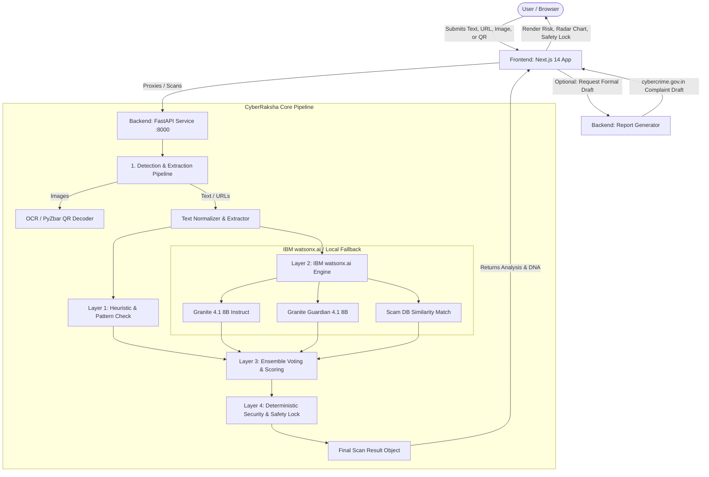

# CyberRaksha 

**AI-Powered Cybersecurity Awareness & Emergency Protection Assistant for Modern Digital Fraud**

[](https://fastapi.tiangolo.com)
[](https://nextjs.org)
[](https://www.typescriptlang.org)
[](https://www.python.org)
[](https://www.ibm.com/products/watsonx-ai)

---

##  Overview

**CyberRaksha** is an intelligent, multi-layered cybersecurity defense and awareness platform engineered to protect users from pervasive digital scams, phishing campaigns, deceptive URLs, and fraudulent QR/UPI payment schemes. Designed with a particular focus on prevalent Indian cyber fraud vectors (such as RBI/Police impersonation, fake electricity bill disconnections, bank KYC deactivation threats, and deceptive lottery schemes), CyberRaksha operates on a closed-loop security paradigm:

$$\textbf{Detect} \longrightarrow \textbf{Explain} \longrightarrow \textbf{Alert} \longrightarrow \textbf{Prevent} \longrightarrow \textbf{Guide}$$

By uniting **IBM Granite 4 foundation models** (via IBM watsonx.ai) with **deterministic security policies**, OCR vision processing, and QR/UPI payload decoding, CyberRaksha ensures fast, transparent, and actionable protection for digital citizens.

---

##  Problem Statement

Digital financial fraud and social engineering scams are escalating exponentially:
* **Sophisticated Social Engineering**: Scammers exploit urgency, fear, and authority impersonation (e.g., CBI/RBI/Customs arrest threats, electricity cutoff warnings) to coerce victims into rapid compliance.
* **Complex Multi-Channel Vectors**: Malicious payloads are distributed across SMS, WhatsApp messages, deceptive short-links, and weaponized QR codes (quishing).
* **Language & Awareness Barriers**: Victims often lack technical knowledge, and critical security warnings are rarely localized in their native language.
* **Post-Incident Paralysis**: Once scammed, victims are unaware of immediate mitigation steps or how to draft a formal complaint for law enforcement portals like `cybercrime.gov.in`.

---

##  Solution

CyberRaksha bridges the gap between AI threat intelligence and deterministic safety enforcement:
1. **Multi-Modal Input Ingestion**: Analyzes suspicious raw text, suspicious URLs, SMS screenshots, and payment QR codes in a unified scanner.
2. **Hybrid Intelligence**: Combines LLM semantic understanding (IBM Granite Instruct) and safety guardrails (IBM Granite Guardian) with deterministic heuristic engines, regex patterns, and known scam databases.
3. **Deterministic Safety Lock**: AI outputs advise on risk, but an uncompromising, deterministic URL & UPI policy controls navigation and access—preventing accidental link clicks or reverse-payment UPI transfers.
4. **Transparent "Scam DNA" Breakdown**: Explains *why* a message is dangerous using 5 dimensional behavioral indicators (Urgency, Fear, Impersonation, Suspicious Links, Payment Pressure).
5. **Actionable Emergency Guidance & Reporting**: Delivers multilingual mitigation steps (English, Hindi, Marathi) and auto-generates structured, ready-to-file complaint drafts compliant with the National Cyber Crime Reporting Portal (1930 helpline).

---

## ✨ Key Features

* **Unified Threat Scanner**: Seamlessly scan plain text messages, extract text from screenshot images via OCR, decode QR payloads, or analyze raw URLs.
* **Scam DNA Radar Analysis**: Visualizes threat vectors across 5 core dimensions: *Urgency, Fear, Impersonation, Suspicious Links,* and *Payment Pressure* on an interactive radar chart.
* **Deterministic Safety Lock**: Automatically intercepts high-risk links, quarantines dangerous destinations, and requires explicit user confirmation before navigating medium-risk URLs.
* **Emergency Cyber Alert System**: Triggers high-priority visual alarms for critical threats with 1-click dial access to the **1930** National Cyber Crime Helpline.
* **Multilingual Remediation Guides**: Generates step-by-step guidance in **English (EN)**, **Hindi (HI)**, and **Marathi (MR)**.
* **Automated Cyber Crime Complaint Drafter**: Compiles scan evidence, timeline, scam classification, suspect details, and financial impact into a standardized complaint draft for `cybercrime.gov.in`.
* **Local Fallback & Fail-Safe Architecture**: Gracefully transitions to deterministic rule-based evaluation if cloud AI services are unreachable, ensuring zero downtime.
* **User Authentication & Scan History**: Protected sessions with JWT authentication and persistent local scan logs.

---

##  Tech Stack

### Frontend
* **Framework**: [Next.js 14](https://nextjs.org/) (App Router, Server Actions, API Route Handlers)
* **Language**: [TypeScript](https://www.typescriptlang.org/)
* **Styling**: [Tailwind CSS](https://tailwindcss.com/)
* **UI Components & Icons**: [Lucide React](https://lucide.dev/), Tailwind Merge, Class Variance Authority
* **Data Visualization**: [Recharts](https://recharts.org/) (Scam DNA Radar Chart)
* **Auth & State**: JWT (`jsonwebtoken`), `bcryptjs`, HTTP-only Cookies

### Backend
* **Framework**: [FastAPI](https://fastapi.tiangolo.com/) (Python 3.10+)
* **Server**: [Uvicorn](https://www.uvicorn.org/) (ASGI Server)
* **Validation & Schemas**: [Pydantic v2](https://docs.pydantic.dev/)
* **HTTP Client**: [Requests](https://requests.readthedocs.io/)

### AI & Machine Learning
* **Platform**: [IBM watsonx.ai](https://www.ibm.com/products/watsonx-ai) (`ibm-watsonx-ai`, `ibm-cloud-sdk-core`)
* **Instruct Model Target**: `ibm/granite-4.1-8b-instruct` (Live scam classification, reasoning, and multilingual guidance)
* **Safety Guardrail Target**: `ibm/granite-guardian-4.1-8b` (Content safety and risk validation)
* **Vision Target**: `ibm/granite-4.0-3b-vision` (Configured target; current MVP leverages local Tesseract OCR pipeline)
* **Embeddings Target**: `ibm/granite-embedding-107m-multilingual` (Configured target; current MVP uses deterministic n-gram similarity against local scam corpus)

### Computer Vision & Decoders
* **OCR**: [Pytesseract](https://pypi.org/project/pytesseract/) & [Pillow (PIL)](https://pillow.readthedocs.io/)
* **QR Decoding**: [OpenCV (cv2)](https://opencv.org/) & [PyZbar](https://pypi.org/project/pyzbar/)

### Storage & Utilities
* **Data Store**: JSON Document Store (`frontend/data/cyberraksha.json`)
* **Parsing**: [BeautifulSoup4](https://www.crummy.com/software/BeautifulSoup/) & [lxml](https://lxml.de/)

---

##  Project Architecture



### Component Flow:
1. **Frontend Client**: Captures inputs through a tabbed interface (Text, URL, Screenshot, QR) and renders interactive risk meters, Scam DNA radar plots, safety locks, and guidance panels.
2. **Detection Pipeline (`detect_pipeline.py`)**: Sanitizes text, executes OpenCV/PyZbar to decode QR payloads (including UPI deep-links), and runs Tesseract OCR to read text from screenshot uploads.
3. **AI Reasoning & Guardrails (`watsonx_client.py`)**: Invokes IBM Granite models to extract indicators, assign scam categories, and generate multilingual advice. When API keys are absent, the system seamlessly uses deterministic local fallbacks.
4. **Deterministic Security Engine (`app/security/`)**: Evaluates URL entropy, punycode spoofing, IP hosts, suspicious TLDs, and malicious UPI parameters. Overrules model outputs if deterministic high-risk conditions are triggered.
5. **Complaint Generation Engine (`report_generator.py`)**: Assembles evidence, timestamps, classification, and suspect details into a structured complaint draft ready for copy-pasting to `cybercrime.gov.in`.

---

##  Project Structure

```text
CyberRaksha/
├── backend/
│   ├── app/
│   │   ├── api/
│   │   │   ├── routes.py            # Primary scan and security evaluation endpoints
│   │   │   └── report_routes.py     # Cybercrime complaint draft generation endpoint
│   │   ├── core/
│   │   │   ├── config.py            # Environment configurations and risk thresholds
│   │   │   ├── schemas.py           # Pydantic models for scan requests and responses
│   │   │   └── report_schemas.py    # Pydantic schemas for report generator
│   │   ├── scam_db/
│   │   │   └── similarity.py        # Local scam pattern repository & similarity matcher
│   │   ├── security/
│   │   │   ├── emergency_alert.py   # Emergency alert threshold handler
│   │   │   ├── qr_analyzer.py       # QR code payload classifier
│   │   │   ├── safety_lock.py       # Navigation access control & containment logic
│   │   │   ├── safety_policy.py     # Deterministic safety policy evaluator
│   │   │   ├── upi_analyzer.py      # UPI deep link & reverse payment analyzer
│   │   │   └── url_analyzer.py      # URL structure, domain entropy & phishing heuristics
│   │   └── services/
│   │       ├── analysis_ensemble.py # Multi-signal scoring and ensemble voting
│   │       ├── detect_pipeline.py   # Input normalization, OCR, and QR extraction
│   │       ├── report_generator.py  # Law enforcement complaint text synthesis
│   │       └── watsonx_client.py    # IBM watsonx.ai client with deterministic fallbacks
│   ├── tests/
│   │   └── test_security_layer.py   # Comprehensive unit tests for security policies
│   ├── .env.example                 # Template for backend environment variables
│   ├── debug.py                     # Diagnostic script for checking system readiness
│   ├── main.py                      # FastAPI application entry point
│   ├── requirements.txt             # Python dependencies
│   └── smoke_test.py                # End-to-end smoke test suite for the scan pipeline
│
├── frontend/
│   ├── app/
│   │   ├── api/                     # Next.js route handlers (auth, scan proxy, report proxy)
│   │   ├── globals.css              # Global styles and Tailwind directives
│   │   ├── layout.tsx               # Root layout and metadata configuration
│   │   └── page.tsx                 # Main application controller
│   ├── components/
│   │   ├── analysis/                # Results, RiskMeter, ScamDNA, SafetyLock, Guidance UI
│   │   ├── auth/                    # Login and registration modal components
│   │   ├── home/                    # Informational landing and awareness pages
│   │   ├── report/                  # Interactive cybercrime report draft viewer
│   │   ├── scan/                    # Unified input form (Text, URL, Screenshot, QR)
│   │   └── ui/                      # Reusable UI primitives (Buttons, Cards, Badges)
│   ├── data/
│   │   └── cyberraksha.json         # Local user store
│   ├── lib/
│   │   ├── api.ts                   # Backend client communication wrappers
│   │   ├── auth.ts                  # JWT token creation and verification
│   │   └── types.ts                 # TypeScript data contracts and interfaces
│   ├── package.json                 # Frontend dependencies and scripts
│   ├── tailwind.config.js           # Tailwind design tokens and animations
│   └── tsconfig.json                # TypeScript compiler configuration
│
├── docs/
│   ├── MODEL_STACK_STATUS.md        # Distinction between live models and local fallbacks
│   ├── SECURITY_INTEGRATION.md      # Security policy integration and architecture notes
│   ├── SECURITY_REVIEW.md           # Security audit findings and mitigations
│   └── CyberRaksha_Hackathon_Report # Full project documentation and architecture report
│
└── README.md                        # Master project documentation
```

---

##  Installation & Setup

### Prerequisites
* **Python 3.10+**
* **Node.js 18.x or 20.x** & **npm**
* **Tesseract OCR** (Optional, required only for local screenshot OCR extraction)
  * *Ubuntu/Debian*: `sudo apt-get install tesseract-ocr`
  * *macOS*: `brew install tesseract`
  * *Windows*: [Tesseract Installer for Windows](https://github.com/UB-Mannheim/tesseract/wiki)

---

### 1. Clone Repository
```bash
git clone https://github.com/Maitreyee-21/CyberRaksha.git
cd CyberRaksha
```

---

### 2. Backend Setup
```bash
# Navigate to backend directory
cd backend

# Create and activate virtual environment
python -m venv venv
# On Windows:
venv\Scripts\activate
# On Linux/macOS:
source venv/bin/activate

# Install dependencies
pip install -r requirements.txt

# Configure environment
cp .env.example .env
```

Edit `backend/.env` with your IBM watsonx.ai credentials (optional — local fallbacks operate automatically if keys are omitted).

```bash
# Run backend server
python main.py
```
*Backend will start on:* `http://127.0.0.1:8000`  
*Interactive Swagger API Docs:* `http://127.0.0.1:8000/docs`

---

### 3. Frontend Setup
```bash
# Open a new terminal and navigate to frontend directory
cd frontend

# Install Node dependencies
npm install

# (Optional) Create local env if backend is on a custom URL
# echo "NEXT_PUBLIC_API_URL=http://localhost:8000" > .env.local

# Start development server
npm run dev
```
*Frontend will start on:* `http://localhost:3000`

---

### 4. Verification & Testing

#### Run Backend Unit Tests:
```bash
cd backend
python -m unittest discover -s tests -v
```

#### Run End-to-End Pipeline Smoke Test:
```bash
cd backend
python smoke_test.py
```

---

##  Environment Variables

### Backend Configuration (`backend/.env`)

```ini
# ==========================================
# IBM watsonx.ai Configuration
# ==========================================
IBM_WATSONX_API_KEY=your_ibm_cloud_api_key_here
IBM_WATSONX_REGION_URL=https://us-south.ml.cloud.ibm.com
IBM_WATSONX_PROJECT_ID=your_watsonx_project_id_here

# ==========================================
# Model Target Identifiers
# ==========================================
MODEL_GRANITE_INSTRUCT=ibm/granite-4.1-8b-instruct
MODEL_GRANITE_GUARDIAN=ibm/granite-guardian-4.1-8b
MODEL_GRANITE_VISION=ibm/granite-4.0-3b-vision
MODEL_GRANITE_EMBEDDING=ibm/granite-embedding-107m-multilingual

# ==========================================
# Server & Security Settings
# ==========================================
HOST=0.0.0.0
PORT=8000
ALLOW_REMOTE_URL_FETCH=false
CORS_ORIGINS=http://localhost:3000,http://127.0.0.1:3000
```

> [!NOTE]
> When `IBM_WATSONX_API_KEY` is not provided, the backend automatically runs in deterministic local fallback mode without crashing.

---

##  Usage

1. **Open the Web Application**: Visit `http://localhost:3000` in your web browser.
2. **Select Threat Input Mode**:
   *  **Text**: Paste suspicious SMS, WhatsApp forwards, email contents, or job offers.
   *  **URL**: Enter an unknown or suspicious link.
   *  **Screenshot**: Upload an image/screenshot of a message or notification.
   *  **QR Code**: Upload a payment QR code image or paste decoded `upi://` URI data.
3. **Execute Analysis**: Click **"Analyze Threat"**.
4. **Review Intelligence Output**:
   * **Risk Score & Badge**: Instant categorization (LOW, MEDIUM, HIGH).
   * **Scam Category**: Specific classification (e.g., *Electricity Bill Scam, Fake KYC, RBI Impersonation, Quishing*).
   * **Scam DNA Radar**: Inspect behavioral manipulation dimensions.
   * **Safety Lock Status**: Check if the link was quarantined or safe to open.
   * **Red Flags**: Granular breakdown of suspicious markers.
5. **Follow Remediation**: Toggle between **English**, **हिंदी**, and **मराठी** to follow step-by-step containment instructions.
6. **Generate Complaint Draft**: Click **"Draft Police Complaint"** to create a formatted cybercrime complaint text ready for submission to `cybercrime.gov.in`.

---

##  API Endpoints

| Method | Endpoint | Description |
| :--- | :--- | :--- |
| `GET` | `/health` | Health check, configured models, threshold metrics, and capability statuses |
| `POST` | `/api/scan` | Primary unified scan endpoint (processes JSON payloads with text, URL, or base64 image) |
| `POST` | `/api/scan/form` | Multipart form endpoint for direct file uploads (screenshots, QR codes) |
| `POST` | `/api/security/analyze-url` | Evaluates URL structure, domain entropy, and applies deterministic Safety Lock policy |
| `POST` | `/api/security/analyze-qr-payload` | Analyzes decoded QR strings and evaluates UPI reverse-charge fraud risks |
| `POST` | `/api/generate-report` | Generates a structured formal complaint draft for cybercrime authorities |

---

##  How It Works

```text
  [User Input] (Text / URL / Image / QR)
       │
       ▼
1. Content Detection & Extraction
   ├── OpenCV / PyZbar: Extracts QR strings & UPI deep-links
   └── Tesseract OCR: Converts image text to normalized strings
       │
       ▼
2. Multi-Layer Analysis Ensemble
   ├── Heuristic Engine: Rule-based regex & brand-spoof pattern matching
   ├── IBM Granite Instruct: Threat reasoning, category detection & translation
   ├── IBM Granite Guardian: Safety guardrail assessment & risk score validation
   └── Local Scam DB: Similarity score matching against known threat corpus
       │
       ▼
3. Deterministic Safety Enforcement
   ├── URL Heuristics (Entropy, Punycode, TLD reputation)
   ├── UPI Directionality Check (Detects merchant vs. debit fraud)
   └── Safety Lock: Enforces BLOCK / WARN / ALLOW (Overrides AI false-negatives)
       │
       ▼
4. Output Synthesis & Protection
   ├── 0–100 Unified Risk Score & 5-Axis Scam DNA
   ├── Multilingual Action Guides (EN / HI / MR)
   └── Ready-to-file cybercrime.gov.in Complaint Draft
```

---

##  Security Considerations

* **Deterministic Override Principle**: AI outputs serve as threat advisors, never as unilateral navigation authorizers. If deterministic URL checks detect dangerous indicators (e.g., raw IP hosts, suspicious TLDs, punycode homographs), the link is unconditionally blocked.
* **No Remote URL Fetching**: Arbitrary remote scraping of user-provided URLs is disabled by default (`ALLOW_REMOTE_URL_FETCH=false`) to prevent server-side request forgery (SSRF) and malicious script execution.
* **Fail-Safe Fallbacks**: If external AI cloud APIs encounter latency or connection errors, the system seamlessly transitions to local heuristic evaluation without dropping threat protection.
* **Zero Secret Leakage**: No hardcoded API keys or credentials exist in the codebase. All sensitive keys are managed via environment variables.
* **Safe Credential Handling**: Frontend user passwords are encrypted using `bcryptjs` with salt rounds, and authenticated state is maintained via HTTP-only secure cookies.

---

##  Screenshots / Demo

*(Screenshots can be placed in `docs/screenshots/` and referenced here)*

| Threat Scanner & Risk Meter | Scam DNA Radar & Red Flags |
| :---: | :---: |
|  *(Preview Placeholder)* |  *(Preview Placeholder)* |

| Safety Lock Interception | Multilingual Guidance & Report Drafter |
| :---: | :---: |
|  *(Preview Placeholder)* |  *(Preview Placeholder)* |

---

##  Future Enhancements

### Planned & Roadmap:
- [ ] **Direct Granite Vision API Integration**: Connect live `ibm/granite-4.0-3b-vision` on watsonx.ai for direct visual layout scam detection alongside OCR.
- [ ] **Granite Multilingual Vector Embeddings**: Connect `ibm/granite-embedding-107m-multilingual` with a vector database (e.g., Milvus / Qdrant) for high-scale semantic scam retrieval.
- [ ] **Browser Extension Gateway**: Build a Chromium extension that intercepts suspicious navigation in real time before page loads.
- [ ] **WhatsApp & SMS Bot Webhook**: Allow users to forward suspicious messages directly to a verified CyberRaksha chatbot.
- [ ] **Real-time Threat Intelligence Feeds**: Integrate automated sync with CERT-In and state police cyber bulletins.

---

##  Team & Contributors

| Member | Role | Core Contributions |
| :--- | :--- | :--- |
| **Maitreyee** | **Team Lead & AI Engineer** | • Project leadership & overall architecture design<br>• IBM watsonx.ai & IBM Granite 4 models integration (Instruct & Guardian)<br>• Scam Analyzer pipeline, Scam DNA 5-axis engine & multilingual guidance system<br>• Frontend co-development & integration |
| **Irshad** | **Backend Engineer** | • FastAPI backend service architecture & async endpoint design<br>• Heuristic Layer 1 detection & multi-signal ensemble voting logic<br>• Automated cybercrime complaint drafting engine (`/api/generate-report`)<br>• Pydantic data contracts & schema validation |
| **Prabuddha** | **Frontend Lead** | • Next.js 14 (App Router) & Tailwind CSS responsive UI/UX implementation<br>• Interactive Scam DNA radar chart visualization (Recharts)<br>• Unified multi-modal input scanner (Text, URL, Screenshot OCR, QR)<br>• Multilingual remediation panel (English, Hindi, Marathi) |
| **Chirag** | **Security Lead** | • Deterministic Security Layer & Safety Lock quarantine architecture<br>• URL phishing heuristics, domain entropy, punycode & TLD risk analysis<br>• UPI deep link payload decoder & reverse-payment fraud detection<br>• Emergency Cyber Alert thresholding & 1930 helpline integration |
| **Shreya** | **QA, Testing & Demo Lead** | • End-to-end smoke testing suite (`smoke_test.py`) & security unit tests (`tests/`)<br>• Real-world Indian scam benchmark dataset curation (RBI, KYC, Electricity, Quishing)<br>• Edge-case evaluation, fail-safe verification & demo presentation |

---

##  License

This project is licensed under the **MIT License** — see the [LICENSE](LICENSE) file for details.
